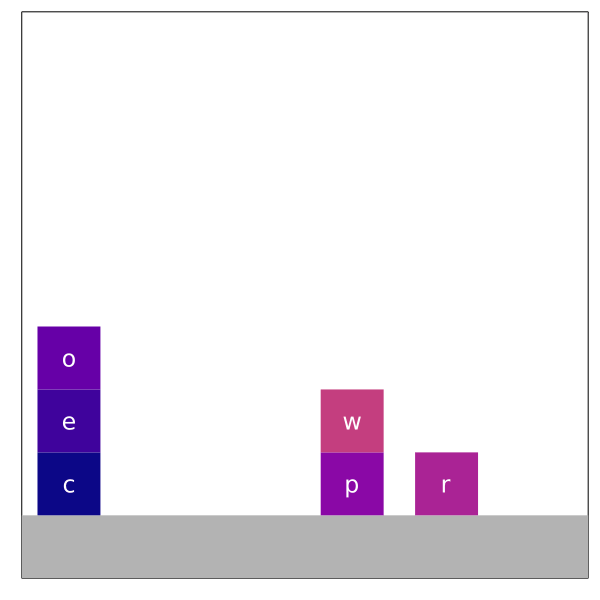
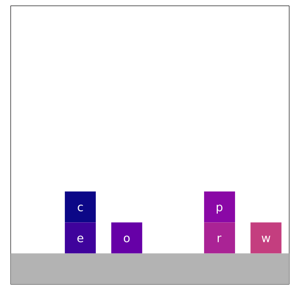
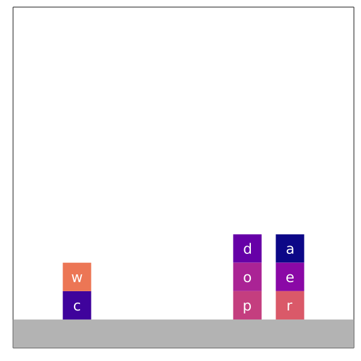

# block-words-web
Web app for inverse planning experiments using Plinf.jl Block Words domain.

## Experiment Scenarios
Data for [stimuli plans](https://docs.google.com/presentation/d/1x_hYhpUz88JUVGs_6K2DFTL7uCX_RffJBpbHSfulPWQ/edit?usp=sharing) is contained in the stimuli folder organized as follows:
### 1. Backtracking
- a. Moving letter on top of a letter you'll need later
- b. Stacking an irrelevant letter on top of the current word 

### 2. Misspelled Words

### 3. Moving unrelated blocks

### 4. Intermediate/initial state matching other (incorrect) goals
- a. Initial configuration already matches an incorrect goal state
- b. Goal words contain other goal words
    - i. SUFFIX- goal: star, wrong goal: tar
    - ii. PREFIX- goal: tart, wrong goal: tar
    - iii. MIDDLE- goal: start, wrong goal: tar
- c. Rhyming words (suffix matches but isn't itself a goal)
        - goal: star, wrong goal: altar

